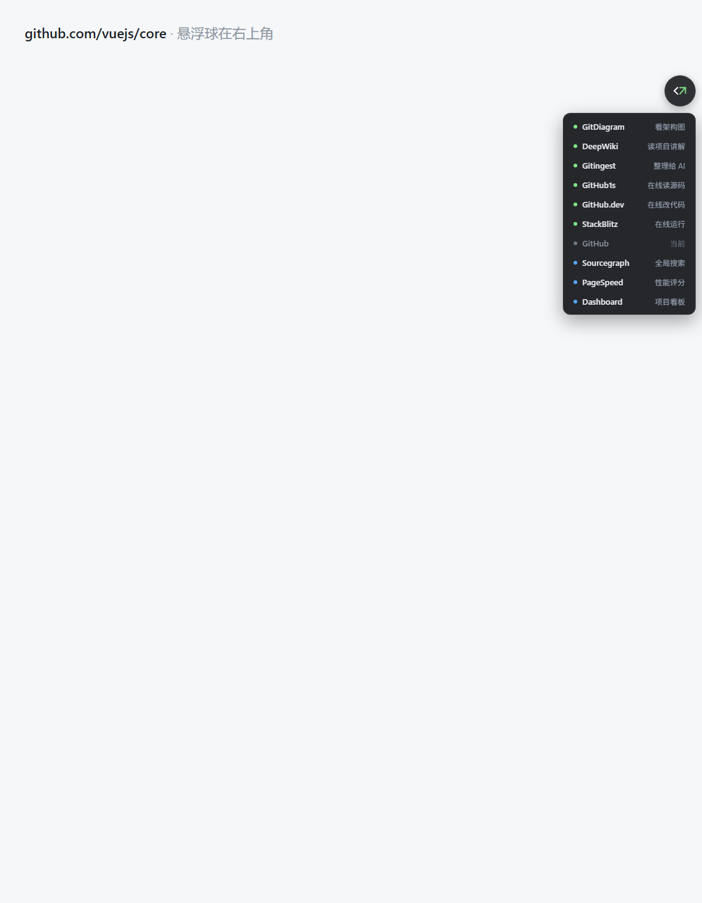
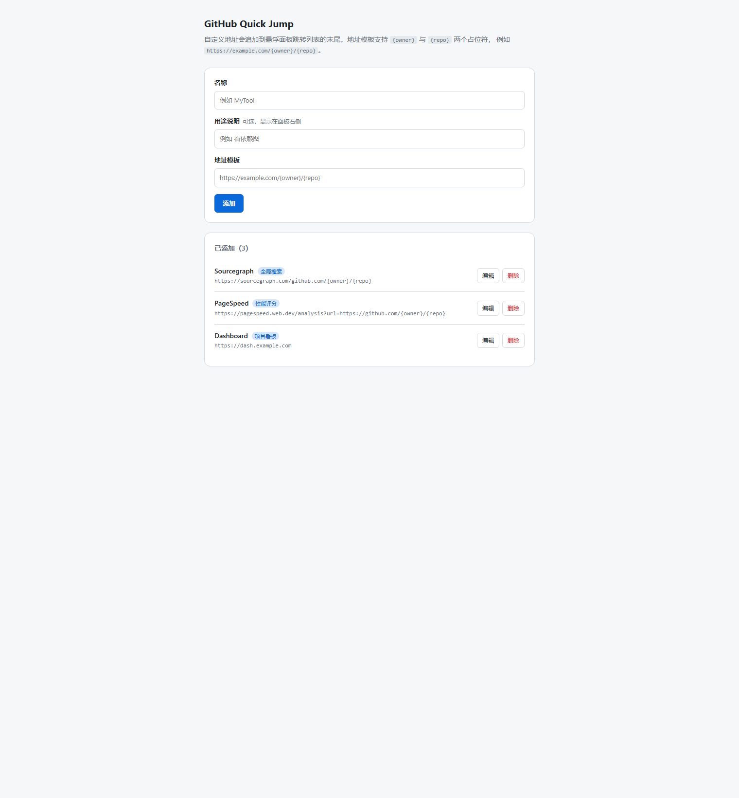

# GitHub Quick Jump

一个 Chrome / Edge 扩展：在 GitHub 仓库页悬浮一个可拖动的按钮，一键把当前仓库 `owner/repo` 拼到第三方服务地址上，在新标签页打开。跳到第三方站点后按钮依然在，可以继续一键切换，也可以一键跳回 GitHub。

灵感来源：B 站视频《GitHub 改一下网址，解锁 6 种打开方式》。

## 功能

- **一键跳转**：在 GitHub 仓库页展开面板，7 个跳转目标随点随开
- **跨站常驻**：6 个第三方站点同样注入，跳过去之后不用退回 GitHub 就能换到别的服务
- **一键回跳**：第三方站点上，列表末尾固定有 GitHub 项，可跳回仓库页
- **当前项置灰**：所在站点的对应项标「当前」并禁用，避免误点重复跳转
- **可拖动**：按钮可拖到屏幕任意高度，松手后吸附最近的左/右边缘，位置自动记住
- **自定义地址**：在选项页自行添加跳转地址，支持 `{owner}` / `{repo}` 占位符
- **工具栏入口**：点工具栏图标即可打开自定义地址页，不用去扩展管理页里翻

## 效果

在 GitHub 仓库页点击右上角悬浮球展开跳转列表（当前浏览器所在的站点会置灰标「当前」）：



在选项页添加自定义跳转地址：



## 支持的跳转目标

| 标签 | 用途 | URL 模板 |
| --- | --- | --- |
| GitDiagram | 看架构图 | `https://gitdiagram.com/{owner}/{repo}` |
| DeepWiki | 读项目讲解 | `https://deepwiki.com/{owner}/{repo}` |
| Gitingest | 整理给 AI | `https://gitingest.com/{owner}/{repo}` |
| GitHub1s | 在线读源码 | `https://github1s.com/{owner}/{repo}` |
| GitHub.dev | 在线改代码 | `https://github.dev/{owner}/{repo}` |
| StackBlitz | 在线运行 | `https://stackblitz.com/github/{owner}/{repo}` |
| GitHub | 回到仓库页 | `https://github.com/{owner}/{repo}` |

前 6 项为第三方服务，第 7 项 GitHub 为回跳入口，固定排在末尾。

## 安装

尚未上架商店，先用开发者模式加载：

1. 下载或 clone 本仓库
2. 打开 `chrome://extensions`（Edge 为 `edge://extensions`）
3. 打开右上角「开发者模式」
4. 点「加载已解压的扩展程序」，选择本仓库根目录

## 使用

打开任意 GitHub 仓库页（如 `https://github.com/vuejs/core`），右上角出现圆形按钮：

- **点击按钮** 展开跳转列表
- **拖动按钮** 调整位置，松手后吸附左右边缘，刷新后位置保持
- **点击列表项** 在新标签页打开对应服务
- **点击空白处或按 Esc** 收起列表

在 GitHub 上，列表里的 GitHub 项显示为「当前」并置灰；跳到 `deepwiki.com/vuejs/core` 之后，则轮到 DeepWiki 项置灰，其余 6 项可点。

按钮只出现在仓库页。GitHub 首页、搜索页、用户主页、设置页，以及第三方站点的首页都不会出现。

## 自定义地址

点工具栏上的扩展图标，在弹窗里点「管理自定义地址」进入选项页；也可以从 `chrome://extensions` 的扩展详情页点「扩展程序选项」进入。在选项页可以增删改自定义跳转地址：

| 字段 | 必填 | 说明 |
| --- | --- | --- |
| 名称 | 是 | 面板左侧显示，最长 20 字符 |
| 用途说明 | 否 | 面板右侧显示，最长 12 字符 |
| 地址模板 | 是 | 完整 http(s) 链接，可含 `{owner}` / `{repo}` 占位符 |

举例，添加 `https://sourcegraph.com/github.com/{owner}/{repo}`，名称 `Sourcegraph`、说明 `全局搜索`，在 `vuejs/core` 页面上就会跳到 `https://sourcegraph.com/github.com/vuejs/core`。不含占位符的模板会作为固定地址打开。

自定义项追加在内置 7 项之后，圆点为蓝色（内置项为绿色）。在选项页改完无需刷新已打开的仓库页，面板会即时更新。

自定义地址存在 `chrome.storage.sync`，会跟随浏览器账号同步；按钮位置存在 `chrome.storage.local`。

## 目录结构

```
github-quick-jump/
├── manifest.json           # Manifest V3 声明
├── content.js              # 全部注入逻辑（含 Shadow DOM 样式）
├── popup.html              # 工具栏弹窗（只负责进入选项页）
├── popup.js
├── options.html            # 自定义地址管理页
├── options.js
├── icons/
│   ├── icon-master.png     # 图标源文件（1024x1024）
│   ├── icon16/32/48/128.png
│   └── render_icons.py     # 由主图生成各尺寸 PNG
├── tests/
│   └── verify-custom.js    # 自定义地址逻辑的断言测试
├── scripts/
│   └── package.js          # 生成 Chrome 商店 zip 的打包脚本
├── PRIVACY.md              # 隐私政策
└── docs/
    ├── images/                    # README 效果图
    └── superpowers/specs/2026-09-30-github-quick-jump-design.md
```

无构建工具、无运行时依赖、无第三方库。

## 开发

改完代码后，在 `chrome://extensions` 点扩展卡片上的刷新按钮，再刷新页面即可生效。

### 测试

```
node tests/verify-custom.js
```

该测试把 `content.js` 中 `'use strict'` 到 `buildWidget` 之间的纯逻辑段取出求值，断言自定义地址的清洗与合并逻辑：脏数据过滤（空名称、非 http(s) 模板、`javascript:`、相对路径、非对象项）、字段 trim、占位符替换与 URL 编码、固定地址、id 唯一性、合并顺序、自定义项不参与「当前」判定。

### 重新生成图标

Chrome 的扩展图标不支持 SVG，必须是位图。`icons/icon-master.png` 是唯一的源文件
（1024x1024，透明背景 + 深色圆角方块 + 白色「<」与绿色「↗」）。改了它之后：

```
pip install pillow
python icons/render_icons.py
```

脚本先用 Pillow 按不透明像素求出图形内容的包围盒，以内容中心裁成正方形并只留一点透明边距，
再降采样生成 16/32/48/128 四个 PNG。只依赖 Pillow，不需要浏览器。

### 打包（上传 Chrome 网上应用店）

生成一个只含运行时文件的 zip，可直接上传 Chrome 网上应用店：

```
node scripts/package.js
```

产物为 `dist/github-quick-jump.zip`，只包含 `manifest.json`、`content.js`、`popup.html`、`popup.js`、`options.html`、`options.js`、`icons/` 下的 4 个图标。不包含 README、隐私政策、文档与测试文件。纯 node 实现、无第三方依赖，跨平台可用。

上传商店时：

- **隐私政策**字段填写 [PRIVACY.md](PRIVACY.md) 的公开地址（例如本仓库该文件在 GitHub 上的渲染页面）
- 商店会校验 zip 里的 `manifest.json` 与图标，脚本已确保文件齐全
- **截图**：商店要求 1280x800 或 640x400。仓库里已备好两张 1280x800 的图：`docs/images/store-panel-1280x800.png`（悬浮面板）与 `docs/images/store-options-1280x800.png`（选项页）。它们是用无头 Chrome 渲染真实 `content.js` / `options.html` 得到的；换成你自己装好扩展后在真实 GitHub 页面上的截图效果更好

## 技术要点

- **Manifest V3**，纯 content script 注入，不使用 background service worker
- **Shadow DOM 隔离样式**，GitHub 改版不会带崩按钮与面板外观
- **URL 反解析**：按域名从 URL 反推 `owner/repo`，跳转模板与反解析互为逆运算，因此在任一站点上都能解析出仓库
- **SPA 路由监听**：GitHub 是 Turbo 单页应用，站内跳转不重载文档。这里**不用** patch `history.pushState` —— content script 跑在隔离世界，和页面各持独立的 `window` 包装对象，改写 `pushState` 拦不到页面自己的调用（已用 CDP 实测确认）。改用三条互补信号：`MutationObserver` 观察 `documentElement` 子节点变化（Turbo 每次渲染都整体替换 `<body>`，这既是路由变化信号，也是宿主元素被摘掉的信号）、`popstate` 覆盖前进后退、1 秒轮询兜底只改 URL 的情况
- **不可信输入处理**：渲染前一律清洗 `chrome.storage.sync` 里的自定义地址，丢弃非 http(s) 模板，跳转链接始终带 `rel="noopener noreferrer"`

## 已知限制

- 只支持 Chrome / Edge（Manifest V3），未做 Firefox 兼容
- 不校验仓库是否存在，私有或不存在的仓库会直接拼接地址，由第三方服务返回 404
- 自定义地址的排序、分组、启用开关未做，编辑只能在选项页进行
- 站内软导航靠 DOM 变化与轮询识别，只改 URL 不换 DOM 的情况最坏有 1 秒延迟

## 隐私

本扩展**不收集、不存储、不上传任何个人数据，也不向任何服务器发送网络请求**。它只在本地保存按钮位置（`chrome.storage.local`）与你添加的自定义地址（`chrome.storage.sync`），并在你点击跳转项时向相应第三方服务打开链接。详见 [PRIVACY.md](PRIVACY.md)。

## 许可证

[MIT](LICENSE)